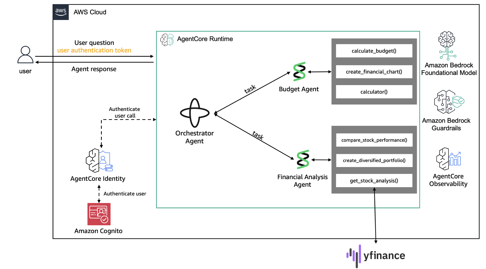

# Finance Personal Assistant

This sample extends the [finance-personal-assistant](https://github.com/awslabs/amazon-bedrock-agentcore-samples/tree/main/02-use-cases/finance-personal-assistant) sample use case from the Amazon Bedrock AgentCore Samples repository.

Temporal is used to orchestrate two micro-agents, each of which are implemented using Strands. 



## Demo

### Run locally

From the `temporal` directory you will need two - three terminal windows (note, you will also need a temporal service running - the code in this repo connects to [Temproal Cloud](https://cloud.temporal.io/).)

1. Run the Temporal worker with
```
uv run python -m temporal.worker
```

2. Interact with the agent
```
uv run python -m temporal.start_workflow
```

#### Simulating a network outage

You will need a third terminal window for this.

The implementation of the `get_forecast` tool includes a 10 second sleep between the two HTTP requests. Experiment with the following:
- Run it with no firewall rules
- Add the firewall rules and enable the firewall
- Disable the firewall, accept the MCP tool execution and then enable the firewall within 10 seconds. Disable the firewall on the 11th second and see what happens.


##### Using `pfctl` on a Mac

We will simulate a network outage by adding firewall rules using `pfctl`. This repository includes a `pf.rules` file that has URLs I am currently seeing for the NWS API. You can check what these are right now with the following command:
```
dig +short api.weather.gov
```

The following commands are used to set and delete the rules, and enable and disable the firewall.

To set rules
```
sudo pfctl -f pf.rules
```

To remove the rules. WARNING: this will delete all rules - you are using pfctl for real, use with caution.
```
sudo pfctl -F all
```

To see the current list of rules:
```
sudo pfctl -s rules
```

To enable the firewall
```
sudo pfctl -e
```

To disable the firewall
```
sudo pfctl -d
```

### Run on AgentCore

- this is done from the `lab3-deploy_agents_on_amazon_bedrock_agentcore.ipynb` notebook
