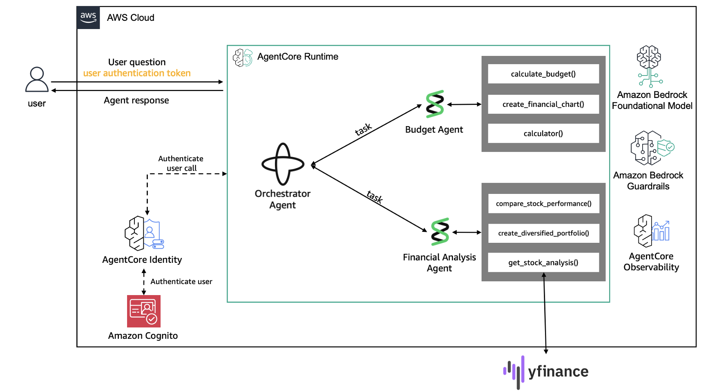

# Finance Personal Assistant

This sample extends the [finance-personal-assistant](https://github.com/awslabs/amazon-bedrock-agentcore-samples/tree/main/02-use-cases/finance-personal-assistant) sample use case from the Amazon Bedrock AgentCore Samples repository.

Temporal is used to orchestrate two micro-agents, each of which are implemented using Strands. 



## Demo

### Prerequisites 

1. Create and activate a virtual environment
```bash
python -m venv .venv
source .venv/bin/activate
```

2. Install dependencies

The `requirements.txt` at the root includes a few foundations that are used in this (and, eventually, other) samples. 

```bash
pip install -r ../requirements.txt
```
And now the dependencies for this project

```bash
pip install -r requirements.txt
```

3. Export/Activate required AWS Credentials for the notebook to run

4. Register your virtual environment as a kernel for Jupyter notebook to use
```bash
python -m ipykernel install --user --name=notebook-venv --display-name="Python (notebook-venv)"
```

You can list your kernels using:
```bash
jupyter kernelspec list
```

5. Run the notebook and ensure the correct kernel is selected
```bash
jupyter notebook path/to/your/notebook.ipynb
```

6. Setup connectivity to Temporal Cloud

```bash
export TEMPORAL_ADDRESS=us-east-1.aws.api.temporal.io:7233 #this may be different for you
export TEMPORAL_NAMESPACE=<your temporal namespace>
export TEMPORAL_API_KEY=<your temporal API key>
```

### Run locally

During development we likely want to run locally to shorten development cycle times.

From the `temporal` directory you will need two - three terminal windows (note, you will also need a temporal service running - the code in this repo connects to [Temproal Cloud](https://cloud.temporal.io/).)

0. Authenticate to AWS

```bash
aws sso login --profile <your profile>
```
Note that your mileage my vary - you may have other ways that you autheticate to AWS 

1. Run the Temporal worker with
```
uv run python -m temporal.worker
```

2. Interact with the agent
(in a second terminal window)
```
uv run python -m temporal.start_workflow
```

#### Simulating a network outage

You will need a third terminal window for this.

The implementation of the `get_forecast` tool includes a 10 second sleep between the two HTTP requests. Experiment with the following:
- Run it with no firewall rules
- Add the firewall rules and enable the firewall
- Disable the firewall, accept the MCP tool execution and then enable the firewall within 10 seconds. Disable the firewall on the 11th second and see what happens.


##### Using `pfctl` on a Mac

We will simulate a network outage by adding firewall rules using `pfctl`. This repository includes a `pf.rules` file that has URLs I am currently seeing for the NWS API. You can check what these are right now with the following command:
```
dig +short api.weather.gov
```

The following commands are used to set and delete the rules, and enable and disable the firewall.

To set rules
```
sudo pfctl -f pf.rules
```

To remove the rules. WARNING: this will delete all rules - you are using pfctl for real, use with caution.
```
sudo pfctl -F all
```

To see the current list of rules:
```
sudo pfctl -s rules
```

To enable the firewall
```
sudo pfctl -e
```

To disable the firewall
```
sudo pfctl -d
```

### Run on AgentCore

Running on AgentCore is done through the `agentcore_setup.ipynb` notebook.

#### Prerequisites

Set the `TEMPORAL_API_KEY` in an `.env` file at the root of the `finance-personal-assistant`

#### About the AgentCore deployment

AWS Bedrock AgentCore Runtime provides a serverless execution environment. AgentCore `.launch` creates the deployment, however, there will only be active instances when requests are made to the entrypoint of the agent. 
The unit of deployment to AgentCore Runtime is the Temporal worker.
But Temporal is event driven - the worker looks for work on task queues and dispatches that work to the appropriate part of the application.

How the agent lifecycle is managed must, therefore, be carefully addressed. One option is to set the container idle timeout very high - the maximum is 8 hours. This may, however, result in idle containers. How to handle AgentCore Runtime autoscaling for Temporal deployments will be addressed in the future.

The good news is that Temporal does not depend on a container staying alive for the duration of the agent execution. If the container goes away, when it comes back, the agent will pick up where it left off, care of Temporal.

There is a cell in the notebook that sets the container idle timeout to 60 seconds - this allows us to demostrate the durability that Temporal delivers.

Further details are found in the notebook.


