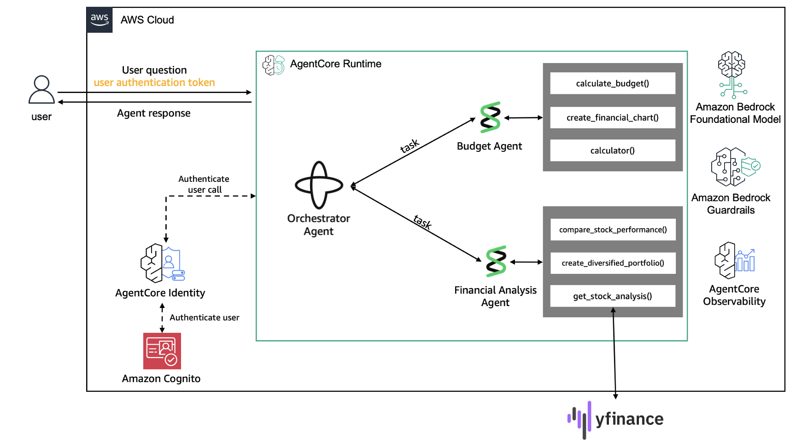

# Finance Personal Assistant

This sample extends the [finance-personal-assistant](https://github.com/awslabs/amazon-bedrock-agentcore-samples/tree/main/02-use-cases/finance-personal-assistant) sample use case from the Amazon Bedrock AgentCore Samples repository.

Temporal is used to orchestrate two micro-agents, each of which are implemented using Strands. 



## Demo

### Prerequisites 

1. Create and activate a virtual environment
```bash
python -m venv .venv
source .venv/bin/activate
```

2. Install dependencies

The `requirements.txt` at the root includes a few foundations that are used in this (and, eventually, other) samples. 

```bash
pip install -r ../requirements.txt
```
And now the dependencies for this project

```bash
pip install -r requirements.txt
```

3. Export/Activate required AWS Credentials for the notebook to run

4. Register your virtual environment as a kernel for Jupyter notebook to use
```bash
python -m ipykernel install --user --name=notebook-venv --display-name="Python (notebook-venv)"
```

You can list your kernels using:
```bash
jupyter kernelspec list
```

5. Run the notebook and ensure the correct kernel is selected
```bash
jupyter notebook path/to/your/notebook.ipynb
```

6. Setup connectivity to Temporal Cloud

```bash
export TEMPORAL_ADDRESS=us-east-1.aws.api.temporal.io:7233 #this may be different for you
export TEMPORAL_NAMESPACE=<your temporal namespace>
export TEMPORAL_API_KEY=<your temporal API key>
```

### Run locally

During development we likely want to run locally to shorten development cycle times.

From the `temporal` directory you will need two - three terminal windows (note, you will also need a temporal service running - the code in this repo connects to [Temproal Cloud](https://cloud.temporal.io/).)

0. Authenticate to AWS

```bash
aws sso login --profile <your profile>
```
Note that your mileage my vary - you may have other ways that you autheticate to AWS 

1. Run the Temporal worker with
```bash
uv run python -m temporal.worker
```

2. Interact with the agent
(in a second terminal window)
```bash
uv run python -m temporal.start_workflow
```

#### Simulating a network outage

You will need a third terminal window for this.

The implementation of the `get_forecast` tool includes a 10 second sleep between the two HTTP requests. Experiment with the following:
- Run it with no firewall rules
- Add the firewall rules and enable the firewall
- Disable the firewall, accept the MCP tool execution and then enable the firewall within 10 seconds. Disable the firewall on the 11th second and see what happens.


##### Using `pfctl` on a Mac

We will simulate a network outage by adding firewall rules using `pfctl`. This repository includes a `pf.rules` file that has URLs I am currently seeing for the NWS API. You can check what these are right now with the following command:
```bash
dig +short api.weather.gov
```

The following commands are used to set and delete the rules, and enable and disable the firewall.

To set rules
```bash
sudo pfctl -f pf.rules
```

To remove the rules. WARNING: this will delete all rules - you are using pfctl for real, use with caution.
```bash
sudo pfctl -F all
```

To see the current list of rules:
```bash
sudo pfctl -s rules
```

To enable the firewall
```bash
sudo pfctl -e
```

To disable the firewall
```bash
sudo pfctl -d
```

### Run on AgentCore

The [setup notebook](./agentcore_setup.ipynb) deploys this Temporal Worker as an AgentCore Serverless Worker. Temporal Cloud starts the Worker when its Task Queue has work, and the Worker drains after 60 idle seconds.

#### Prerequisites

Use an AWS-hosted Temporal Cloud namespace with the AgentCore Serverless Workers feature enabled, an AgentCore-supported AWS Region, AWS credentials, and Temporal CLI v1.8.3 or newer. From this directory, install the project and notebook tools:

```bash
uv sync --python 3.12
uv pip install --python .venv/bin/python jupyterlab ipykernel
```

Copy `.env.example` to `.env` and set the Temporal Cloud address, namespace, API key, AWS Region, a new build ID, and an External ID. The `.env` file is ignored by Git.

#### Get the Temporal Worker running

Open `.venv/bin/jupyter lab` and run `agentcore_setup.ipynb` in order. It stores the API key in Secrets Manager, deploys the AgentCore Runtime and a named endpoint, creates an IAM role for Temporal Cloud to invoke it, and registers the endpoint as a Worker Deployment Version. Validate the connection in Temporal Cloud before running the notebook cell that makes the version current.

#### Interact with the agent

```bash
uv run python -m temporal.start_workflow
```

The CLI starts a Workflow, queries its recommended investment amount, and signals the amount to invest. Let the Worker drain while the Workflow waits for the signal; Temporal will start AgentCore capacity again when the signal creates more work. Use a new build ID for each deployment run and keep old named endpoints while pinned Workflows may still need them.
