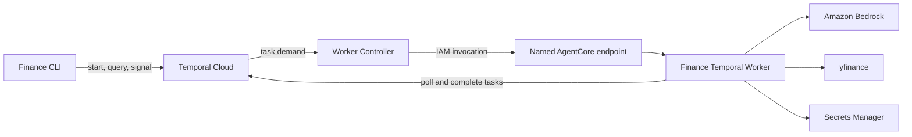

# Finance Personal Assistant

This sample extends the [AgentCore finance personal assistant](https://github.com/awslabs/amazon-bedrock-agentcore-samples/tree/main/02-use-cases/finance-personal-assistant). A Temporal Workflow coordinates the budget and financial analysis agents, waits for an investment amount, and resumes when it is signaled.


```mermaid
flowchart LR
    Client[Finance CLI] -->|start, query, signal| Temporal[Temporal Cloud]
    Temporal -->|task demand| WCI[Worker Controller]
    WCI -->|IAM invocation| Endpoint[Named AgentCore endpoint]
    Endpoint --> Worker[Finance Temporal Worker]
    Worker -->|poll and complete tasks| Temporal
    Worker --> Bedrock[Amazon Bedrock]
    Worker --> Market[yfinance]
    Worker --> Secret[Secrets Manager]
```

## Run locally

Install [uv](https://docs.astral.sh/uv/) and the [Temporal CLI](https://docs.temporal.io/cli), then run from this directory:

```bash
uv sync --python 3.12
temporal server start-dev
```

In another terminal, start the Worker. It uses `localhost:7233` unless `TEMPORAL_ADDRESS` is set. Set AWS credentials and Bedrock model access before running the real agent Activities.

```bash
uv run python -m temporal.worker
```

In a third terminal, start and interact with a finance Workflow:

```bash
uv run python -m temporal.start_workflow
```

The CLI prints the Workflow ID. Enter `query` to read the recommended investment amount, then enter a number to signal the requested investment amount. Pass the UUID from that Workflow ID to `temporal.start_workflow` to reconnect to a running execution.

Run the local Worker lifecycle and Workflow tests with `uv run python -m unittest discover -s tests -v`. They use a local Temporal test server and stub external model and market-data calls.

## Deploy as an AgentCore Serverless Worker

Temporal's [AgentCore Serverless Workers integration](https://docs.temporal.io/production-deployment/worker-deployments/serverless-workers/agentcore) is in Pre-release. Deployment requires an AWS-hosted Temporal Cloud namespace with access to the feature, Temporal CLI v1.8.3 or newer, an AgentCore-supported AWS Region, and AWS credentials allowed to create AgentCore, ECR, IAM, CloudFormation, and Secrets Manager resources. The Runtime needs public outbound access to Temporal Cloud, Bedrock, and the market-data source.

The finance Activities use Amazon Nova 2 Lite through the `us.amazon.nova-2-lite-v1:0` inference profile and call Bedrock in `AWS_REGION`. The model ID is defined in `temporal/models.py`. Anthropic models require the account's [first-time use case form](https://docs.aws.amazon.com/bedrock/latest/userguide/model-access.html) before they can replace this default.

1. Run `uv sync --python 3.12 --extra notebook` here, then start Jupyter with `.venv/bin/jupyter lab` from this directory and select the project's Python kernel.
2. Copy `.env.example` to `.env`. Set the Temporal Cloud connection, API key, a new `TEMPORAL_BUILD_ID`, `TEMPORAL_INVOKE_EXTERNAL_ID`, and AWS Region. Authenticate to AWS before opening the notebook. `.env` is ignored by Git. The Workflow starter loads it automatically.
3. Run [agentcore_setup.ipynb](./agentcore_setup.ipynb) in order. It stores the API key in Secrets Manager, deploys the Worker Runtime with IAM inbound authorization, grants its execution role access to the secret and Bedrock, and creates a named endpoint pinned to that Runtime version.
4. The notebook creates a separate role that Temporal Cloud assumes to invoke the Runtime, then registers the named endpoint as a Temporal Worker Deployment Version. In Temporal Cloud, use **Workers → the finance deployment → the new version → Actions → Validate Connection**. Run the notebook's next cell to make that version current.
5. Run `.venv/bin/python -m temporal.start_workflow`. No manual AgentCore invocation is needed. Temporal starts AgentCore capacity when the task queue needs a Worker.

The Worker stops polling after 60 seconds without Activity work and drains before AgentCore releases the session. Let it drain while the Workflow waits for an investment amount. Then signal a number in the CLI and confirm Temporal starts capacity again and the Workflow finishes. Use the Temporal Worker Deployment view and AgentCore Runtime logs to inspect both starts.

Set a **new** build ID for each notebook deployment run. The new named endpoint must point to the new immutable Runtime version; keep the old endpoint while pinned Workflows can still need it. Existing executions started on the old unversioned Worker should finish on that Worker before it is retired.

The Runtime's execution role reads the Temporal API key secret and calls Bedrock. Temporal Cloud assumes the separate invocation role from [cloud_agentcore_invoke_role.yaml](./temporal/cloud_agentcore_invoke_role.yaml) to invoke the named endpoint. The template follows [Temporal's published role policy](https://docs.temporal.io/files/temporal-cloud-serverless-worker-agentcore-role.yaml).
